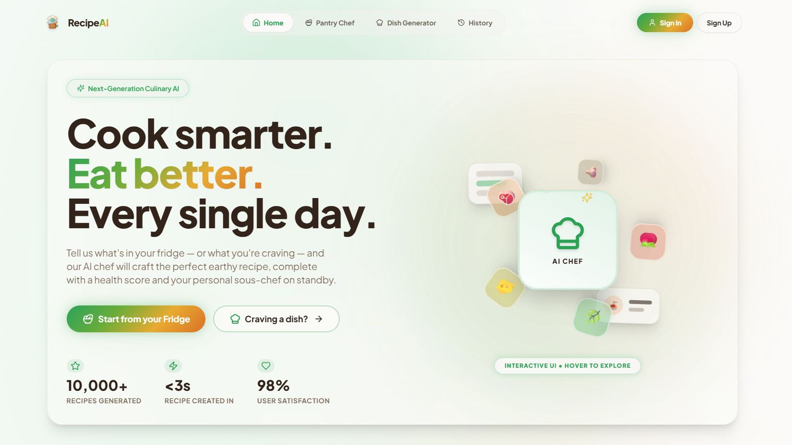

<div align="center">
  
  
  # 👨‍🍳 RecipeAI
  **Your Personal AI-Powered Culinary Assistant & Recipe Generator**

  <p align="center">
    
    
    
    
    
    
    
  </p>
</div>

---

## ✨ Overview
**RecipeAI** is a modern, beautifully designed web application that brings an expert AI Sous-Chef directly into your kitchen. Whether you have specific ingredients you need to use up, or you're just craving a specific dish, RecipeAI generates perfectly tailored recipes, nutritional facts, and step-by-step cooking instructions on demand.

## 🖼️ App Preview



## 🚀 Key Features

* 🥗 **Pantry Chef (Ingredient-First Cooking)**
  Tell the AI what ingredients you have in your fridge, select your desired cuisine, and let it generate a delicious recipe specifically tailored to reduce food waste and match your cravings. Includes **Quick Action Cards** for instant meal ideas (e.g., Quick Breakfast, Pasta Night).
  
* 🪄 **Dish Generator**
  Craving something specific? Type the name of any dish (e.g., "Butter Chicken" or "Vegan Lasagna"), and RecipeAI will instantly magically generate a complete, structured recipe layout with health analysis and cooking times.

* 🤖 **Interactive AI Sous-Chef Chatbot**
  Every generated recipe comes alongside a context-aware AI assistant. You can chat with the assistant in real-time to ask about ingredient substitutions, history of the dish, or specific cooking techniques. 

* 💫 **Stunning, Fluid User Interface**
  Built with **Framer Motion**, the interface features buttery-smooth micro-animations, glassmorphism UI elements, dynamic scroll restoration, and a highly responsive layout that looks great on both mobile and desktop.

* 🔐 **Clerk Authentication (Protected App Flows)**
  Pantry Chef, Dish Generator, Chat, and History are protected using Clerk authentication. The app uses a custom sign-in/sign-up UI powered by `@clerk/clerk-js` for full UI control.

* 🕘 **Activity History with Supabase Postgres**
  User activity is stored in Supabase transaction pooler Postgres and displayed in a dedicated History page with separate sections for **Pantry Chef** and **Dish Generator**.

* 🧹 **One-Click Clear History**
  Users can clear only their own activity history from the History screen using a secure authenticated API.

---

## 🛠️ Tech Stack

### Frontend (Client-Side)
- **Framework:** [React 18](https://reactjs.org/) + [Vite](https://vitejs.dev/)
- **Language:** [TypeScript](https://www.typescriptlang.org/)
- **Styling:** [Tailwind CSS](https://tailwindcss.com/) + custom CSS utility classes
- **UI Components:** [shadcn/ui](https://ui.shadcn.com/) (Radix UI)
- **Animations:** [Framer Motion](https://www.framer.com/motion/)
- **Routing:** [React Router](https://reactrouter.com/)
- **Data Fetching:** Fetch API / built-in hooks
- **Deployment Ready:** Vercel

### Backend (Server-Side)
- **Framework:** [FastAPI](https://fastapi.tiangolo.com/) (Python 3.11)
- **Server:** [Uvicorn](https://www.uvicorn.org/)
- **AI Integration:** [Groq API](https://groq.com/) using the `llama-3.3-70b-versatile` model for lightning-fast inference.
- **Authentication:** [Clerk](https://clerk.com/docs) custom flow (`@clerk/clerk-js` + `@clerk/clerk-react`) with backend JWT verification via Clerk JWKS
- **Activity Storage:** Supabase Postgres (transaction pooler) via `psycopg`
- **Data Validation:** Pydantic models
- **Environment Management:** python-dotenv
- **Deployment Ready:** Render

---

## 💻 Local Development Setup

### 1. Clone the repository
```bash
git clone https://github.com/chandadiya2004/RecipeAI.git
cd RecipeAI

```

### 2. Backend Setup
Navigate to the backend folder and set up your Python environment:
```bash
cd backend
python -m venv venv
source venv/bin/activate  # On Windows use `venv\Scripts\activate`
pip install -r requirements.txt
```

Create a `.env` file in the `backend/` directory:
```env
# backend/.env
GROQ_API_KEY=your_groq_api_key_here
ALLOWED_ORIGINS=*
CLERK_FRONTEND_API=https://your-clerk-instance.clerk.accounts.dev
CLERK_JWKS_URL=https://your-clerk-instance.clerk.accounts.dev/.well-known/jwks.json
CLERK_ISSUER=https://your-clerk-instance.clerk.accounts.dev
CLERK_AUDIENCE=
CLERK_SECRET_KEY=your_clerk_secret_key_here
SUPABASE_DB_URL=your_supabase_transaction_pooler_postgres_url
```

> If your DB password contains special characters (like `@`), URL-encode it in `SUPABASE_DB_URL` (example: `@` → `%40`).

Start the FastAPI server:
```bash
uvicorn main:app --reload
```
*The backend will be running at `http://localhost:8000`*

### 2.1 Backend API Summary

- `POST /api/generate-recipe` (auth required)
- `POST /api/chat` (auth required)
- `GET /api/activity-history` (auth required)
- `DELETE /api/activity-history` (auth required, clears current user history only)

### 3. Frontend Setup
Open a new terminal, navigate to the frontend folder:
```bash
cd frontend
npm install
```

Create a `.env` file in the `frontend/` directory:
```env
# frontend/.env
VITE_API_URL=http://localhost:8000
VITE_CLERK_PUBLISHABLE_KEY=your_clerk_publishable_key_here
```

After signing in, open `/history` in the app to view grouped activity in:
- Pantry Chef
- Dish Generator

Start the Vite development server:
```bash
npm run dev
```
*The frontend will be running at `http://localhost:8080`*

---

## ☁️ Deployment Guides

### Backend (Render)
1. Push your repository to GitHub.
2. Connect your repo to Render as a **Web Service**.
3. Render will automatically detect the `render.yaml` and `backend/.python-version` files.
4. Set environment variables in Render dashboard:
  - `GROQ_API_KEY`
  - `ALLOWED_ORIGINS`
  - `CLERK_FRONTEND_API`
  - `CLERK_JWKS_URL`
  - `CLERK_ISSUER`
  - `CLERK_AUDIENCE`
  - `CLERK_SECRET_KEY`
  - `SUPABASE_DB_URL`
5. Provide the Render URL to your frontend.

### Frontend (Vercel)
1. Import your GitHub repository to Vercel.
2. Set the **Root Directory** to `frontend`.
3. Add environment variables:
   - `VITE_API_URL` pointing to your deployed Render backend (e.g., `https://recipeai-backend.onrender.com`)
  - `VITE_CLERK_PUBLISHABLE_KEY`
4. Custom SPA routing rules are already configured via the included `vercel.json` file.
5. Deploy!

---

## 🧰 Troubleshooting

- **History not updating**
  - Ensure backend has `psycopg` installed: `pip install -r requirements.txt`
  - Confirm `SUPABASE_DB_URL` is valid and reachable
  - Confirm Clerk backend envs (`CLERK_JWKS_URL` / `CLERK_ISSUER`) are set correctly
  - Restart backend after env/package changes

- **`No module named psycopg`**
  - Install in the same Python environment used to run Uvicorn

- **Port already in use (`WinError 10048`)**
  - Stop existing process on port 8000 or run backend on another port:
    - `uvicorn main:app --reload --port 8001`

---

<div align="center">
  <p>Built with ❤️ and AI.</p>
</div>
